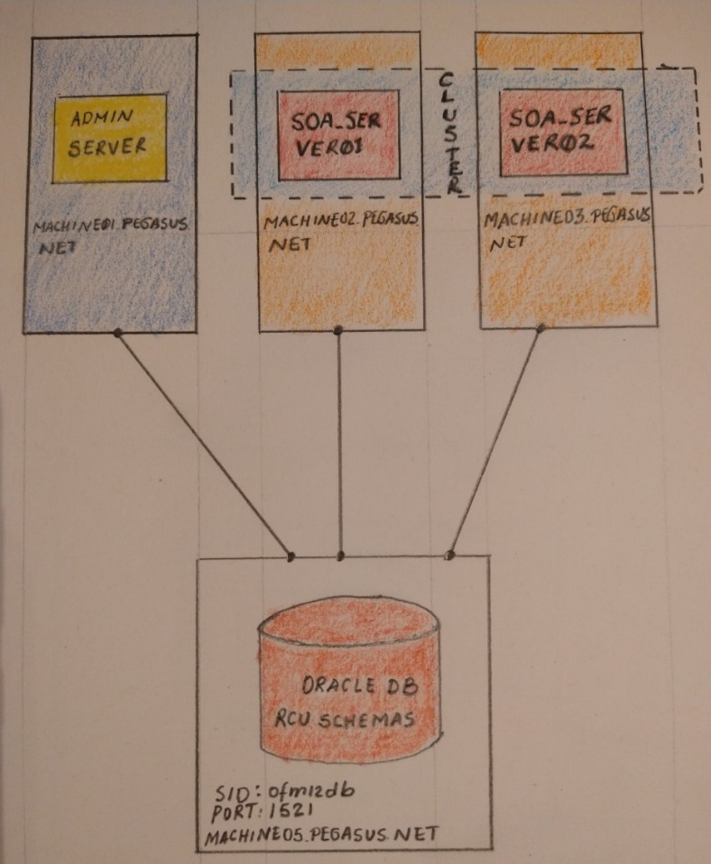
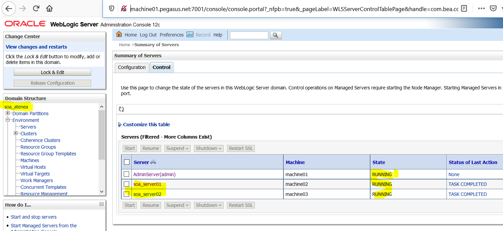

Weblogic Deploy Tooling and Ansible to create a SOA 12.2.1.4 domain
===================================================================
This document explains how to use Weblogic Deploy Tooling and a set of Ansible playbooks provided in this repository to install, patch and configure an Oracle SOA domain 12.2.1.4.

Architecture implemented
------------------------

The architecture tested with these playbooks is composed by the following elements.

1.  Three CentOS Linux 7 machines for application servers.

2.  A Red Hat Enterprise Linux Server 7.7 for the database.

3.  Oracle database version 12.2.0.1.0.

The Oracle Weblogic domain configured within these playbooks is described by the following picture.

As you can see on the previous picture, we have these components.

1.  An AdminServer running on its own machine, which a good practice for performance.

2.  Two managed servers each one running on its own machine.

3.  A cluster composed by two managed servers.

4.  An Oracle database 12c used to install RCU schemas required by SOA.

5.  User: oracle

6.  Group: oinstall

7.  This is the list of machines

| Machine                  | Usage                        |
|--------------------------|------------------------------|
| machine01.pegasus.net    | AdminServer                  |
| machine02.pegasus.net    | Managed Server soa\_server01 |
| machine03.pegasus.net    | Managed Server soa\_server02 |
| A laptop with Ubuntu WSL | Ansible controller           |

How have you configured Ansible?
--------------------------------

As I am using Windows 10, I have configured WSL Ubuntu to access the target machines that by the way are running on Oracle Virtual Box; which means I have configured the user **oracle** and the group **oinstall** on my WSL Ubuntu, which I do not think it is a good idea. However, this is just a demo.

Why have you written this ?
---------------------------

After years Oracle has provided a tool that helps to automate the provisioning of Weblogic domains. Thus, I wanted to test it.

This means, this time I do not need to write any Weblogic Scripting Tool scripts. I am just using Weblogic Deploy Tooling to create the SOA domain.

Which technologies have you used here?
--------------------------------------

I have used:

1.  Documentation about Weblogic and SOA 12.2.1.4. which is available [here][1].

2.  Ansible.

3.  Python and Weblogic Scripting Tool (WLST). You should try [this book][] to get deeper into WLST.

4.  Jinja2 templating. The [template designer documentation][] is useful.

5.  JSON Query Filters and [JMESPath][].

6.  Some theory about PKI/SSL.

7. Weblogic Deploy Tooling [Weblogic Deploy Tooling][].

Ingredients
-----------

1.  An Ansible controller, as I said before, I am using Ansible on WLS Ubuntu, which is out of the box with Windows 10.

2.  Target machines where SOA domain will be installed. In this case I am using 3 Linux Centos 7 machines.

3.  Create the **oracle** user on target machines and on Ansible controller machine with the same user id.

4.  Create the **oninstall** group on target machines and on Ansible controller machine with the same group id.

5.  Configure SSH for **oracle** user between Ansible controller and target machines.

6.  Configure SSH for **oracle** user between target machines. This is because I am using the Ansible module called **synchronize.**

7.  You also need a directory called **/u01/software/** with the following files

    1.  jdk-8u251-linux-x64.tar.gz -&gt; JDK installer.

    2.  p28186730\_139422\_Generic.zip -&gt; Patch for OPatch

    3.  p30729380\_122140\_Generic.zip -&gt; Patch

    4.  p30970477\_122140\_Generic.zip -&gt; Patch

    5.  p30995852\_122140\_Generic.zip -&gt; Patch

    6.  SOA\_12.2.1.4\_V983383-01.zip -&gt; SOA 12.2.1.4 installer

    7.  V983368-01.zip -&gt; FMW 12.2.1.4 infrastructure

    8. weblogic-deploy.zip -&gt; Weblogic Deploy Tooling release

8.  I am using this home for **oracle** user **/u01/oracle/**

9.  An Oracle 12c database and the password for **sys** as these playbooks include a role to run RCU. You can install an Oracle database and configure it with [this][2].

Wait a minute, what about passwords?
------------------------------------

This is a hot topic and I am using vault to encrypt passwords. You can configure your own passwords [here][3]. The password used to edit, encrypt and decrypt the vault file is **oracle**.

How could I run this?
---------------------

You should execute this

    ansible-playbook --ask-vault-pass -i inventories/dev/hosts site.yml --extra-vars "environment_chosen=dev" -vvv

The previous command will ask for the vault password, which is **oracle**

What happen when site.yml is executed?
======================================

This is the entry point, which will execute a set of roles that are described shortly below.

### os\_settings

This role will modify kernel limits for processes and files. Furthermore, this also installs pip, Pexpect, cryptography and pyOpenSSL.

directories
-----------

This role creates part of the directories that are needed to install Weblogic and SOA.

### installation

This role installs Java Development Kit, Oracle Weblogic 12.2.1.4 and Oracle SOA 12.2.1.4.

### patching

This role patches OPatch, Oracle SOA, Oracle Weblogic and Oracle Coherence.

### certificates

This role creates self-signed certificates and configure key stores, trust stores and SSL for the SOA domain.

### createsoadomain

By using Weblogic Deploy Tooling, this role creates a SOA domain with the architecture explained at the beginning of this document. Importantly, Weblogic Deploy Tooling is also used to create RCU schemas.

### pack

This role packs the domain to distribute it from the AdminServer machine into managed server machines.

### unpack

This role unpacks the domain to distribute it from the AdminServer machine into managed server machines.

### nodemanagerservice

This role configures three node managers for AdminServer, soa\_server01 and soa\_server02 as Linux services.

### configurewlst

This role configures the file **wlst\_internal.sh** to allow using nmConnect over SSL.

How could I start services after executing site.yml?
----------------------------------------------------

As I have not had time to create a playbook to start services, you should do this part manually.

### On the AdminServer machine.

    sudo systemctl start nmadminserver.service

    /u01/oracle/product/fmw12214/oracle_common/common/bin/wlst.sh

    nmConnect('nmUser', 'weblogic123456', 'machine01.pegasus.net', '5759', 'soa_atenea', '/u01/oracle/domains/soa_atenea', 'ssl')

    nmStart('AdminServer')

### On managed server machines

    sudo systemctl start nmmanagedserver.service

### Weblogic console.

Finally use the Weblogic console to start managed servers; if everything goes well you will see this.

### Do you need support?

You can contact me here complexsystemsblog@gmail.com

  [this]: https://github.com/oracle/weblogic-deploy-tooling/blob/master/site/discover.md
  [here]: https://github.com/textanalyticsman/ansible-soa/blob/master/inventories/dev/group_vars/all/configuration.yml
  [JSON Query Filter]: https://docs.ansible.com/ansible/latest/user_guide/playbooks_filters.html#json-query-filter
  [1]: https://docs.oracle.com/en/middleware/fusion-middleware/12.2.1.4/imedg/index.html
  [this book]: http://rampant-books.com/book_0214_weblogic_automation.htm
  [template designer documentation]: https://jinja.palletsprojects.com/en/2.11.x/templates/
  [JMESPath]: https://jmespath.org/tutorial.html
  [2]: https://github.com/textanalyticsman/ansible-oracledb
  [3]: https://github.com/textanalyticsman/ansible-soa/blob/master/inventories/dev/group_vars/all/vault.yml
  [Weblogic Deploy Tooling]: https://github.com/oracle/weblogic-deploy-tooling